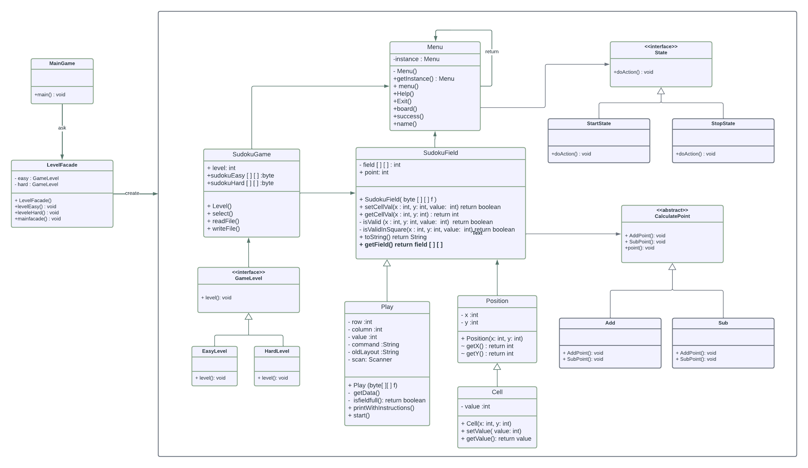

# Sudoku Game  

This is a text-based Sudoku game developed in Java, running in the terminal within NetBeans. The game allows players to solve Sudoku puzzles while following structured software design principles.  

## How to Play  
- Choose a difficulty level: **Easy** or **Hard**.  
- Enter a **row, column, and value** to fill a cell in the Sudoku grid.  
- If the value is correct, your score **increases by 5 points**.  
- If the value is incorrect, your score **decreases by 2 points**.  
- You can **pause the game and resume later**.  

## Design Patterns Implemented  

This project follows best software development practices by applying multiple design patterns:  

1. **Singleton (Creational Pattern)**  
   - Ensures only one instance of the menu is created for efficient game management.  

2. **Facade (Structural Pattern)**  
   - Simplifies interaction with game logic by providing a unified interface for level selection and game management.  

3. **State (Behavioral Pattern)**  
   - Manages different game states, including **playing, paused, and completed**, ensuring smooth transitions.

 ## Class digram 
 

## Technologies & Tools  
- **Java** – Core programming language  
- **NetBeans** – Development environment  
- **Object-Oriented Programming (OOP)** – Used to structure the game efficiently 
